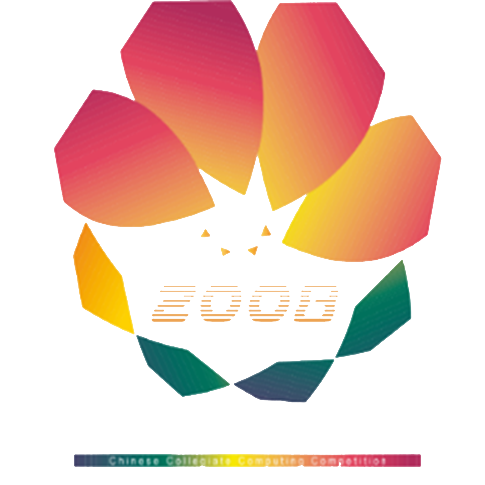

<div align="center">

# 警告: 此库仍在开发中，请勿用于生产环境


<div>
<div style="display:inline-block;width:100px;height:100px">


</div>

<!-- <div style="display:inline-block;width:100px;height:100px">



</div> -->

</div>

# 😊 [TDSCore](http://ds.zsh2401.top)


[2021-CCCC 一等奖作品](https://2021.jsjds.com.cn/Backend/Common/work/detail?id=2021009237)

中文 | [English](./README-en-US.md)

```sh
npm i tdscore
```

纯`TypeScript`实现的数据结构，算法，数学程式✨


[](https://github.com/zsh2401/tdscore/actions/workflows/test.yml)
[](https://github.com/zsh2401/tdscore/actions/workflows/publish.yml)

[](https://app.codecov.io/gh/zsh2401/tdscore)
[](https://david-dm.org/zsh2401/tdscore)

[](https://www.npmjs.com/package/tdscore)


[](https://qm.qq.com/cgi-bin/qm/qr?k=nKqxAm6bD7ty6ieZKA31dQrxboBMZmGT&jump_from=webapi)

</div>

## 介绍
TDSCore目前主要有两个设计用途：科研与应用。一方面，TDSCore中包含大量注释，并力求设计的易理解，以供所有人研习源码。另一方面，项目单元测试覆盖率超过80%，确保在常见与极端情况下的代码健壮性，可用性。

## 特点
* 可读性高：开发的首要目标为研习🌌
* IXA模块：JavaScript生态中的Linq
* 到处运行：运行在任何ES6环境
* 麻雀虽小：min+gzipped 30kB
* 五脏俱全：数据结构与算法持续添加中
* QJS支持：[tdscore-app-template](https://github.com/zsh2401/tdscore-app-template)

## 已经实现
| 线性结构 | 非线性结构 | 算法 | 数学 | 迭代|
| ---- | ---- | ---- | ---- | ---- | 
|**DSArray** | **HashMap** |**hash(∀)** |Trigonometric | **Chain** |
| ArrayList | 图结构定义 | BFS | cos | append |
| **LinkedList**  |树结构定义|DFS | **Martix(OOP)** |contains |
| BitSpan| **AVL**  | BST | Martix(Classic) | filter|
|Queue |BiTreeNode |bubbleSort | 无限精度(DSNumber) | defaultOrFirst|
| **GList** |HashSet | **quickSort** | Linear transformation | filter |
| Stack |**SetGraph** | shellSort | Complex | forEach|
| CQueue |  | radixSort | Hamming Code | indexOf|
| | | insertionSort | Color | isEmpty |
| | | selectionSort | fab | last |
| | | heapSort | |reverse |
| | | seqSearch | |selectMany |
| | | binarySearch ||  size |
| | | prim | |toList/Map/Set |
| | | **kruskal**| | where | |
| | | **treeForEach** | |  min/max|

## 设计理念
* 避免使用`undefined`
* 尽可能使用异常而不是null
* 函数式与面向对象API同步推进
* 力求API高度抽象与推广
* 系统自洽

# 安装 
NPM🧡
```sh
npm install tdscore --save
```
浏览器🗺
```html
<srcipt src="//cdn.jsdelivr.net/npm/tdscore/dist/tdscore.min.js"></script>
```

# 使用🎉
```typescript
import { HashMap } from "tdscore"

let hashMap = new HashMap<string,number>();

hashMap.mapPut("a",1);
console.log(hashMap.mapGet("a")); // 1
```
TDSCore同时支持通过以下方式引入：
* 浏览器全局变量 `window.tdscore`
* CommonJS `require("tdscore")`

另外，在RunKit上在线试用，您不需要配置任何开发环境。

[RunKit for TDSCore](https://npm.runkit.com/tdscore)

# 文档 🍕
[**查看在线文档**](http://ds.zsh2401.top)

# 加入开发🤝
热烈欢迎任何对数据结构感兴趣的朋友加入开发！
欢迎Pull Request!

## 克隆并且切换到dev分支
```sh
git clone https://github.com/zsh2401/tdscore.git
cd tdscore
git fetch origin dev
git checkout dev
```
## 安装依赖
```sh
yarn
```
## 构建与测试
```sh
# 打包为umd单文件模块，输出产物位于dist文件夹
yarn build:dist 

# 编译为es6代码，输出产物位于es文件夹
yarn build:es 

# 编译为ES5代码，输出产物位于lib文件夹
yarn build:lib 

# 同步执行上面全部任务
yarn build
```
### 单元测试
```sh
yarn test
```

注意：
* 请在dev分支上进行开发

# 贡献者
所有代码贡献者头像会被展示在此：

<a href="https://github.com/zsh2401/tdscore/graphs/contributors">
  
</a>

# 协议
TDSCore以[木兰宽松许可证第二版](http://license.coscl.org.cn/MulanPSL2)进行授权。